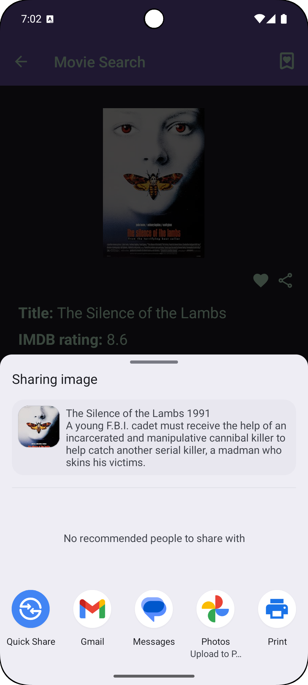

# MovieSearch_for_HuaweiAppGallery
MovieSearch! is an app for movie and TV show enthusiasts, allowing users to find information using the OMDb API. You can add movies and TV shows to favorites for quick access, view posters, seasons, and detailed episode information.

- **Search Window (Compose) / Окно поиска**  
  

- **Movie Information / Информация о фильме**  
  

- **TV Show Information / Информация о сериале**  
  

  - **User's Favorite Media / Избранные медиа пользователя**  
  

  - **App Usage Example / Пример использования приложения**  
  

- **Ability to Share Movie Information with a Friend via Messengers / Возможность отправки информации о фильме другу через Мессенджеры**  
  
